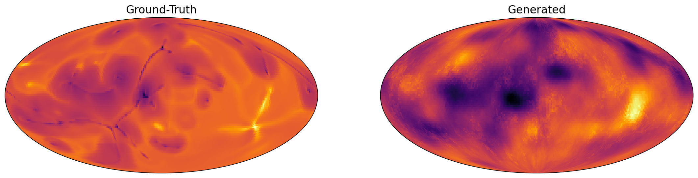

EarthGAN - Earth Mantle Surrogate Modeling
==============================

> Can a surrogate model of the [Earth’s Mantle Convection data set](https://scivis2021.netlify.app/data/) be built such that it can be readily run in a web-browser and produce high-fidelity    results? We're trying to do just that through the use of a generative adversarial network -- we call ours EarthGAN. We are in active research.


See how EarthGAN currently works! Open up the Colab notebook and create results from the preliminary generator: [](https://colab.research.google.com/github/tvhahn/EarthGAN/blob/master/notebooks/3.0_generate_fake_example.ipynb)





Progress updates, along with my thoughts, can be found in the [devlog](devlog/). The preliminary results were presented at VIS 2021 as part of the SciVis contest. See the paper on arXiv, [here](https://arxiv.org/abs/2110.13315).

**This is active research.** If you have any thoughts, suggestions, or would like to collaborate, please reach out! You can also post questions/ideas in the [discussions section](https://github.com/tvhahn/EarthGAN/discussions).


[](https://github.com/tvhahn/EarthGAN/blob/master/src/models/train_model.py) [](https://arxiv.org/abs/2110.13315)

Watch the presentation here:

[](http://www.youtube.com/watch?v=QGjWRk3mMHk "EarthGAN presentation")

Feel free to cite the research if you find it useful in your work:

```
@article{von2021earthgan,
  title={EarthGAN: Can we visualize the Earth's mantle convection using a surrogate model?},
  author={von Hahn, Tim and Mechefske, Chris K},
  journal={arXiv preprint arXiv:2110.13315},
  year={2021}
}
```

## Current Approach

We're leveraging the excellent work of Li et al. who have implemented a GAN for creating [super-resolution cosmological simulations](https://www.pnas.org/content/118/19/e2022038118). The general method is in their [map2map](https://github.com/eelregit/map2map) repository. We've used their GAN implementation as it works on 3D data. Please cite their work if you find it useful!

The current approach is based on the [StyleGAN2](https://github.com/NVlabs/stylegan2) model. In addition, a conditional-GAN (cGAN) is used to produce results that are partially deterministic.

## Setup

Works best if you are in a HPC environment (I used Compute Canada). Also tested locally in linux (MacOS should also work).  If you run windows you'll have to do much of the environment setup and data download/preprocessing manually.

To reproduce data pipeline and begin training: *

1. Clone this repo - `clone https://github.com/tvhahn/EarthGAN.git`

2. Create virtual environment. Assumes that Conda is installed when on a local computer.

   * HPC: `make create_environment` will detect HPC environment and automatically create environment from `make_hpc_venv.sh`. Tested on Compute Canada. Modify `make_hpc_venv.sh` for your own HPC cluster.

   * Linux/MacOS: use command from Makefile - `make create_environment

3. Download raw data.

   * HPC: use `make download`. Will automatically detect HPC environment.

   * Linux/MacOS: use `make download`. Will automatically download to appropriate `data/raw` directory.

4. Extract raw data.

   * HPC: use `make download`. Will automatically detect HPC environment. Again, modify for your HPC cluster.
   * Linux/MacOS: use `make extract`. Will automatically extract to appropriate `data/raw` directory.

5. Ensure virtual environment is activated. `conda activate earth`

6. From root directory of `EarthGAN`, run `pip install -e .` -- this will give the python scripts access to the `src` folders.

7. Create the processed data that will be used for training.

   * HPC: use `make data`. Will automatically detect HPC environment and create the processed data.

     > :memo: Note: You will have to modify the `make_hpc_data.sh` in the `./bash_scripts/` folder to match the requirements of your HPC environment

   * Linux/MacOS: use `make data`. 

8. Copy the processed data to the `scratch` folder if you're on the HPC. Modify `copy_processed_data_to_scratch.sh` in `./bash_scripts/` folder.

9. Train!

   * HPC: use `make train`.  Again, modify for your HPC cluster. Not yet optimized for multi-GPU training, so be warned, it will be SLOW!

   * Linux/MacOS: use `make train`.

     

\* Let me know if you run into any problems! This is still in development.

Project Organization
------------

    ├── Makefile           <- Makefile with commands like `make data` or `make train`
    │
    ├── bash_scripts	   <- Bash scripts used in for training models or setting up environment
    │   ├── train_model_hpc.sh       <- Bash/SLURM script used to train models on HPC (you will need to	modify this to work on your HPC). Called with `make train`
    │   └── train_model_local.sh     <- Bash script used to train models locally. Called on with `make train`
    │
    ├── data
    │   ├── interim        <- Intermediate data before we've applied any scaling.
    │   ├── processed      <- The final, canonical data sets for modeling.
    │   └── raw            <- Original data from Earth Mantle Convection simulation.
    │
    ├── models             <- Trained and serialized models, model predictions, or model summaries
    │   └── interim        <- Interim models and summaries
    │   └── final          <- Final, cononical models
    │
    ├── notebooks          <- Jupyter notebooks. Generally used for explaining various components
    │   │                     of the code base.
    │   └── scratch        <- Rough-draft notebooks, of questionable quality. Be warned!
    │
    ├── references         <- Data dictionaries, manuals, and all other explanatory materials.
    │
    ├── reports            <- Generated analysis as HTML, PDF, LaTeX, etc.
    │   └── figures        <- Generated graphics and figures to be used in reporting
    │
    ├── requirements.txt   <- Recommend using `make create_environment`. However, can use this file
    │                         for to recreate environment with pip
    ├── envearth.yml       <- Used to create conda environment. Use `make create_environment` when
    │                         on local compute				
    │
    ├── setup.py           <- makes project pip installable (pip install -e .) so src can be imported
    ├── src                <- Source code for use in this project.
    │   ├── __init__.py    <- Makes src a Python module
    │   │
    │   ├── data           <- Scripts to download or generate data
    │   │   ├── make_dataset.py			<- Script for making downsampled data from the original
    │   │   ├── data_prep_utils.py		<- Misc functions used in data prep
    │   │   ├── download.sh				<- Bash script to download entire Earth Mantle data set
    │   │   │  							   (used when `make data` called)
    │   │   └──download.sh				<- Bash script to extract all Earth Mantle data set files
    │   │    							   from zip (used when `make extract` called)								   
    │   │
    │   ├── models         <- Scripts to train models and then use trained models to make
    │   │   │                 predictions
    │   │   │
    │   │   └── train_model.py
    │   │
    │   └── visualization  <- Scripts to create exploratory and results oriented visualizations
    │       └── visualize.py
    │
    ├── LICENSE
    └── README.md          <- README describing project.

