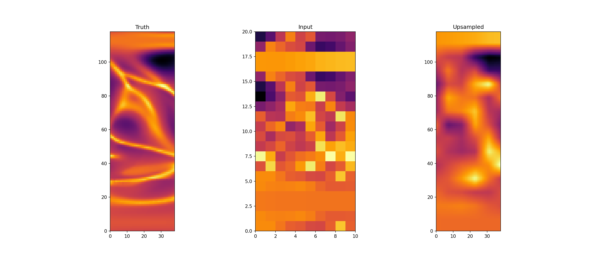
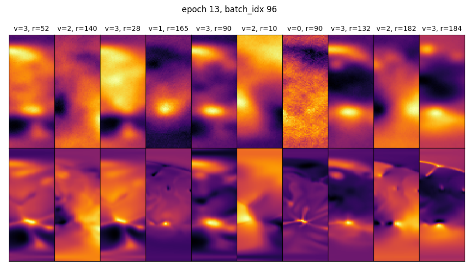
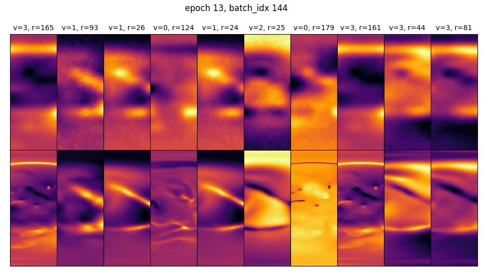
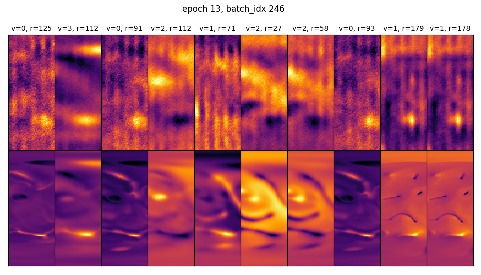
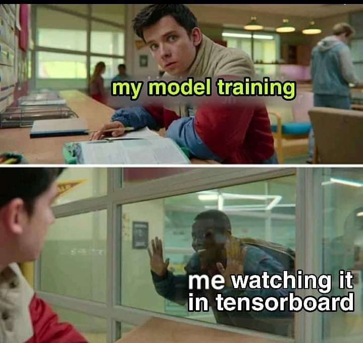

# Devlog

> Thoughts on what I'm working on, struggles, and ideas. Could be an interesting retrospective, one day...
>
> Posts are in descending order (newest to oldest).

## July 16, 2021

The training has begun on the HPC! And watching TensorBoard is addictive.

First thing I noticed, which was no surprise, was how long the training takes. I'm training on all 251 time steps, and it takes 4 hours to train one epoch. Yikes!

The training is slow for a number of reasons. First, I'm training a GAN (like the [stylegan2](https://github.com/NVlabs/stylegan2), at least that's the idea). For each step where the generator is trained the discriminator takes 5 steps to train. 

Second, we're dealing with 3D data, so the models need to be larger. I'm primarily training on P100 GPUs, so about 12 GB of VRAM. The VRAM can quickly become the rate-limiting-step. 

Third, because of the 3D data and the VRAM constraint, I'm making the GAN replicate only a slice of the "Earth" at a time. Below is an image of the truth, input (input to the generator), and upsampled (concatenated onto the inputs to the discriminator). The width of the "truth" data is 38, whereas the full truth data would be 180.

Finally, I have to train the model with only one sample in each mini-batch. Yup, it's slow.

### Results So Far

I am getting results, but I think it's too early to tell if the model will begin to produce realistic results. 

Here's an random sampling of slices from a recent mini-batch.

And another one:

At some point during epoch 13, "stripes" started showing up (see the image below). I think(?) this is positive. Noise is injected into the convolutional layers of the generator. Perhaps, with time, the generator will use this additional noise, and the "stripes", to create sharper features.

In the above to images, the "v" represents the variable and "r" is the radial layer (r=0 closest to core of Earth).

| Variable Index | Variable Name |
| -------------- | ------------- |
| 0              | Temperature   |
| 1              | Velocity x    |
| 2              | Velocity y    |
| 3              | Velocity z    |

So far, the model cannot generate the fine features. But again, the training is slow, and at only 13 epochs I haven't trained much.

### Next Steps

Regardless of what I do next, I think I need faster feedback on whether the model is training. I'll probably let the model train some more (sunk cost fallacy be damned! 😂) and then implement some methods to speed up training.

I can speed up training a number of ways.

1. Train on more GPUs. I could do this, but I'm concerned that if my methodology is flawed, I'll be wasting all my valuable GPU time!
2. Train on less data. Either do this by using fewer time steps (say only train on the first 50 time steps), or by using fewer variables in each sample (e.g. only train on the temperature variable).

I think I'll go for option 2 for now, and then slowly move towards scaling up the training (hello Horovod). 

### Thoughts

This is my first true foray into GANs, and GANs seem even finickier than your "normal" deep learning techniques. But like so many things in life, you learn by doing. 

Here are some of my concerns about my current approach:

* Concern that the input to the generator (making this a conditional-GAN, aka, cGAN) is not informative enough.... Do I need to make the input larger?
* I've had to tune the number of channels, in the discriminator and generator, down from what I originally wanted (from 512 channels, max, to 128 channels, max) in order to allow the model to fit into GPU memory. I'm concerned that their won't be enough "power" in the network now.
* The article by Li et al. on "[AI-assisted superresolution cosmological simulations](https://www.pnas.org/content/118/19/e2022038118)"  is a *huge* source of inspiration and info. Plus, I've used chunks of the code from Yin Li's [map2map repo](https://github.com/eelregit/map2map). In their work, they concatenate the density fields (whatever those are -- I'm no astronomer) onto the inputs to their discriminator. They say that "this addition [was] crucial to generating visually sharp images and accurate predictions of the small-scale power spectra." I'm not doing something like that, but I wonder if I need to? *But what type of data to concatenate?*
* One of my ideas was that it would be better to train with multiple variables at once, like I'm currently doing; that is, train on temperature, and the xyz velocities. Since these variables are all somewhat related, I was hoping that there would be a sort-of [multi-task learning](https://en.wikipedia.org/wiki/Multi-task_learning) benefit, whereby commonalities between the variables could be exploited. I will have to keep this in mind, but for now I think I need faster training.

That's all I have for now. Time to watch my TensorBoard...

